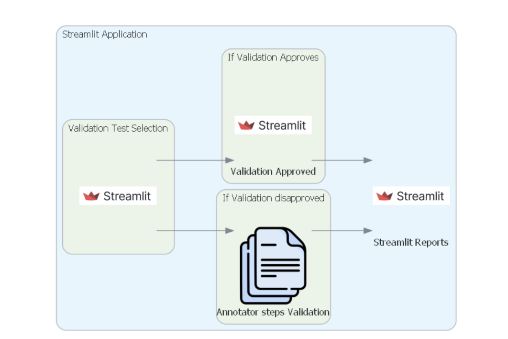

# GAIA Model Evaluation Tool

## **Project Overview**

This project involves building a **Streamlit-based web application** for the Model Evaluation Team to evaluate OpenAI models using the GAIA benchmark dataset. The tool enables users to:

- Select validation test cases from the GAIA dataset.
- Send context and questions from the dataset to an OpenAI model for response generation.
- Compare the model's response to the "final answer" provided in the dataset.
- Modify annotator steps in case of incorrect answers and re-evaluate the model.
- Collect user feedback on evaluations and visualize results.

---

## **Requirements**

### **Functional Requirements**

1. **Dataset Integration**:

   - Load validation test cases from the GAIA dataset (`metadata.jsonl`).
   - Display questions, context, and final answers.

2. **Model Evaluation**:

   - Use OpenAI's API to generate responses based on context and questions.
   - Provide users the option to validate OpenAI's responses against final answers.

3. **User Feedback and Re-Evaluation**:

   - Allow users to modify annotator steps in case of incorrect model responses.
   - Enable re-evaluation with updated annotator steps.
   - Collect user feedback and store it persistently.

4. **Visualization**:

   - Generate charts to summarize feedback and evaluation results.

5. **Security**:
   - Securely manage API keys using environment variables to prevent accidental exposure.

### **Submission Requirements**

1. **GitHub Repository**:

   - ## **Requirements Screenshots**

   ### Requirement 1

   

   ### Requirement 2

   

   - Contains a README file describing project details.
   - Includes the working application (soon :: link deployed on Streamlit Cloud).

---

## **Project Structure**

```plaintext
BigDataChronicles/
│
├── app.py                  # Main Streamlit app for user interaction
├── utils.py                # Utility functions (API integration, validation, feedback handling)
├── database.py             # Handles SQLite database for feedback storage
├── prepare_dataset.py      # Script to prepare GAIA dataset for use
├── minimal_test.py         # Test script for OpenAI API integration
├── metadata.jsonl          # GAIA dataset (validation test cases)
├── feedback.jsonl          # Stores user feedback
├── .env                    # Contains OpenAI API key (excluded from Git)
├── .gitignore              # Excludes sensitive files from version control
├── requirements.txt        # Python dependencies
├── req-1.png               # Requirement screenshot 1
├── req-2.png               # Requirement screenshot 2
└── README.md               # Documentation (this file)


```

## **Application Output**

Here’s an example of how the application’s output looks:


## **Setup Instructions**

1. **Clone the Repository**  
   Clone the project repository using the following commands:

   ```bash
   git clone <repository-url>
   cd BigDataChronicles

   ```

2. **Create a Virtual Environment**

   - For Linux/Mac:
     ```bash
     python3 -m venv env
     source env/bin/activate
     ```
   - For Windows:
     ```bash
     python3 -m venv env
     env\Scripts\activate
     ```

3. **Install Dependencies**

   - Run the following command to install the required Python packages:
     ```bash
     pip install -r requirements.txt
     ```

4. **Set Up OpenAI API Key**

   - Create a `.env` file in the root directory with the following content:
     ```plaintext
     OPENAI_API_KEY=your_openai_api_key_here
     ```
   - Ensure `.env` is included in `.gitignore` to prevent exposing your API key.

5. **Prepare the GAIA Dataset**

   - Run the following command to prepare the dataset:
     ```bash
     python3 prepare_dataset.py
     ```
   - This will generate the `metadata.jsonl` file required by the application.

6. **Run the Application**
   - Start the Streamlit app using this command:
     ```bash
     streamlit run app.py
     ```
   - Open the displayed local URL in your browser to interact with the application.
